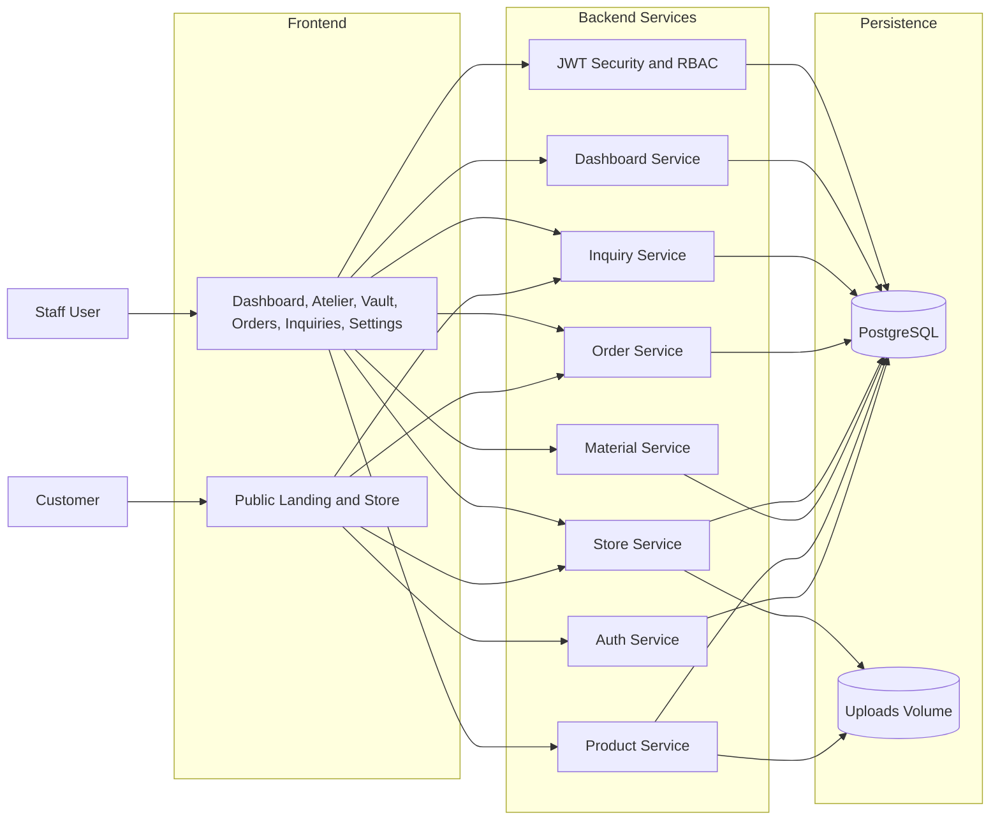
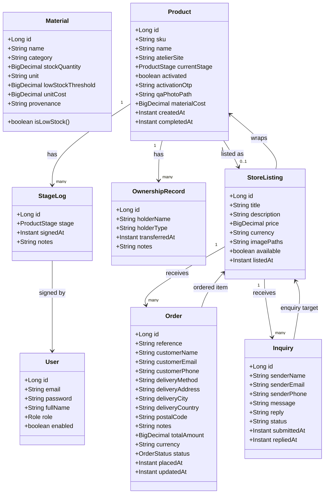
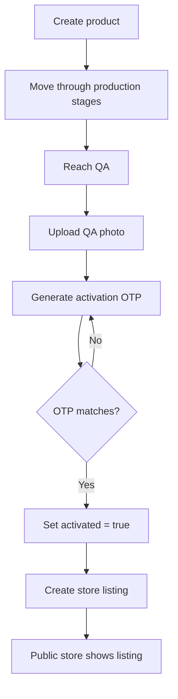
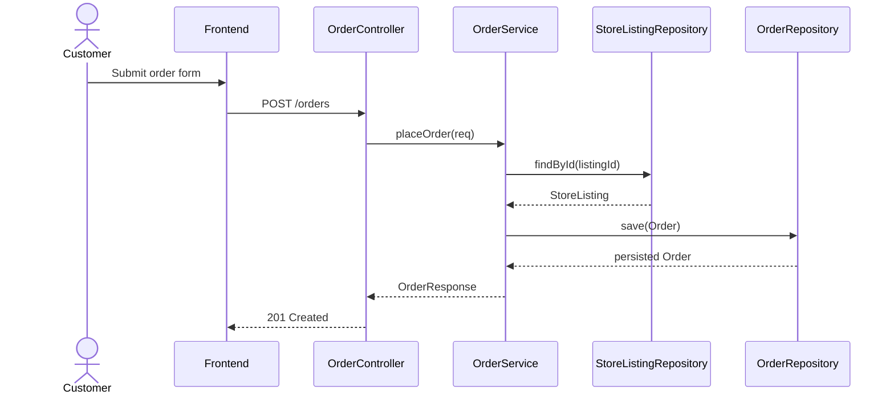
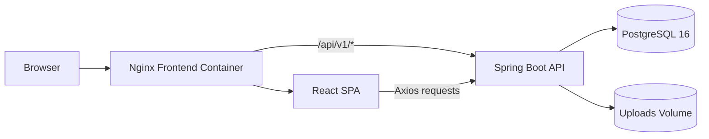

# Zyra Luxury Leather Goods Management System

## Table of Contents
1. [Title Page Details](#1-title-page-details)
2. [Abstract / Executive Summary](#2-abstract--executive-summary)
3. [Introduction](#3-introduction)
4. [General Description and Analysis of the Case Study](#4-general-description-and-analysis-of-the-case-study)
5. [Problem Statement](#5-problem-statement)
6. [System Analysis and Design](#6-system-analysis-and-design)
7. [Prototype Summary](#7-prototype-summary)
8. [Best Programming Practices](#8-best-programming-practices)
9. [Design Pattern Section](#9-design-pattern-section)
10. [Dockerization Section](#10-dockerization-section)
11. [Version Control System Section](#11-version-control-system-section)
12. [Test Plan](#12-test-plan)
13. [Implementation Evidence](#13-implementation-evidence)
14. [Run Instructions](#14-run-instructions)
15. [Demo Accounts or Sample Data](#15-demo-accounts-or-sample-data)
16. [Conclusion](#16-conclusion)

## 1. Title Page Details

| Field | Value |
|---|---|
| Project Title | Zyra Luxury Leather Goods Management System |
| Course Name | Not provided in the repository |
| Case Study | Luxury leather goods atelier operations |
| Student Name | Not provided in the repository |
| Student ID | Not provided in the repository |
| Academic Year | Not provided in the repository |

**Case study note:** The case study above is inferred from the repository README, the domain model, the seeded data, and the UI language. The application is clearly centered on a luxury leather goods atelier, including raw materials, artisan production, QA, store listings, customer orders, and inquiries.

## 2. Abstract / Executive Summary

Zyra is a full-stack web application for managing a luxury leather goods atelier. The system digitises the production lifecycle of bags from raw materials and workshop stages through quality assurance, digital activation, public store listing, customer orders, and post-sale inquiries. The codebase implements a clear separation between a Spring Boot backend, a React/Vite frontend, and a PostgreSQL database, with Docker Compose used to run the full stack as a portable environment.

The backend uses Spring Data JPA for persistence, Spring Security with JWT for authentication, Bean Validation for input validation, and SpringDoc OpenAPI for API documentation. The frontend uses React 19, React Router, Axios, and Recharts to provide an artisan dashboard and a customer-facing store experience. The system also includes seeded demo data, file upload support for QA evidence and listing images, and a public health endpoint for uptime checks.

## 3. Introduction

Luxury leather goods production is a craft-driven business, but it also depends on disciplined operational control. Each bag moves through several production stages, and the business must track materials, artisans, QA evidence, listing status, customer orders, and customer questions. In many small and medium ateliers, this work is still handled with paper notes, spreadsheets, or disconnected messaging tools. That approach makes it difficult to maintain traceability, measure progress, or keep a reliable record of what was produced, sold, and transferred.

The Zyra system was created to address that gap. It provides a single digital record for each physical bag, which is why the repository describes the product model as a digital twin. The system supports both internal staff activities and public customer interactions. Staff can create products, move them through workshop stages, record QA evidence, activate finished products, manage store listings, update orders, and answer inquiries. Customers can browse listings, place orders, and submit questions without needing an account.

The naming in the repository should be understood as follows: **Zyra** is the product or application name, while **kenia** is the internal project structure and folder naming used by parts of the codebase, container configuration, and some seed scripts. The business domain remains consistent throughout the code even where the older internal naming appears.

## 4. General Description and Analysis of the Case Study

The business environment represented here is a premium atelier that designs, produces, and sells leather goods such as totes, clutches, crossbody bags, briefcases, and wristlets. The business depends on several linked activities:

- sourcing raw leather, hardware, lining, and thread;
- tracking stock levels and supplier provenance;
- managing work-in-progress bags across production stages;
- recording QA evidence before final release;
- listing finished bags for sale in a public catalog;
- accepting customer orders and inquiries;
- maintaining ownership history for items that change hands.

This environment is suitable for a digital twin approach because each physical bag can be represented by a single software record. That record can store its SKU, atelier site, current stage, activation status, QA photo path, material cost, stage history, and ownership history. In practical terms, the system is intended to solve the problem of fragmentation. Instead of production notes, stock counts, and sales records being managed separately, the application centralises them.

The repository also includes dashboard visualisation features. These features allow management to see production load, recent activity, stock health, and order status summaries. This indicates that the software is not only a transaction system, but also an operational oversight tool for the atelier.

## 5. Problem Statement

The business problems addressed by the system are the ones typically seen in manual atelier workflows:

- raw materials are hard to track accurately when multiple artisans use the same stock;
- production progress is difficult to audit when stage transitions are not logged;
- QA approval is hard to prove when evidence is stored in messaging apps or local files;
- finished products may be sold before they are formally activated and listed;
- customer orders and inquiries may be scattered across email, phone, and chat;
- management lacks a single dashboard for production and commerce.

In practical terms, the current manual process is inefficient because it creates delays, duplicate work, and missing records. A bag can be physically finished but not digitally traceable. A listing may be published before QA is complete. A customer inquiry may be answered in one message thread while the order appears elsewhere. The application is designed to reduce these gaps by making the bag lifecycle visible in one system from creation to sale.

## 6. System Analysis and Design

### 6.1 Functional Diagram

The following diagram summarises the major functional blocks implemented in the codebase.



This diagram shows the main functions of the system rather than a single screen. It matches the repository structure because the backend is split into controllers and services for authentication, products, materials, store listings, orders, inquiries, and dashboard reporting. The frontend mirrors those functional areas through route-level pages.

### 6.2 Use Case Diagram

```mermaid
flowchart TB
  Customer((Customer))
  Artisan((Artisan))
  Manager((Manager))
  Admin((Admin))

  subgraph System[Zyra System]
    UC1[Register or Login]
    UC2[Browse Store Listings]
    UC3[Place Order]
    UC4[Submit Inquiry]
    UC5[Create Product]
    UC6[Sign Production Stage]
    UC7[Upload QA Photo]
    UC8[Generate Activation OTP]
    UC9[Activate Product]
    UC10[Create or Update Listing]
    UC11[Manage Materials]
    UC12[View Dashboard]
    UC13[Reply to Inquiry]
    UC14[Update Order Status]
  end

  Customer --> UC1
  Customer --> UC2
  Customer --> UC3
  Customer --> UC4

  Artisan --> UC5
  Artisan --> UC6
  Artisan --> UC7
  Artisan --> UC8
  Artisan --> UC9
  Artisan --> UC14

  Manager --> UC10
  Manager --> UC12
  Manager --> UC13
  Manager --> UC14

  Admin --> UC10
  Admin --> UC11
  Admin --> UC12
  Admin --> UC13
  Admin --> UC14
```



This use case view maps directly to the implemented controllers and security rules. Public customer use cases are supported by `AuthController`, `StoreController`, `OrderController`, and `InquiryController`. Staff use cases are controlled by JWT-based access rules in `SecurityConfig`, with role restrictions for dashboard access and material mutations.

### 6.3 Class Diagram



This diagram reflects the actual JPA entities in `backend/kenia/src/main/java/com/auca/zyra/domain`. The `Product` entity is the centre of the model because it connects production tracking, QA activation, listing creation, and ownership transfer. `StageLog` and `OwnershipRecord` provide the audit trail, while `StoreListing`, `Order`, and `Inquiry` represent the commercial side of the platform.

### 6.4 Activity Diagram



This activity diagram represents the implemented product lifecycle. It is supported by `ProductController` and `ProductService`, which handle stage signing, QA photo upload, OTP generation, activation, and ownership transfer. The code enforces the rule that only activated products can be listed for sale.

### 6.5 Sequence Diagram



This sequence matches the actual public order flow in `OrderController` and `OrderService`. The controller receives the request, the service validates the listing, the repository reads the listing and persists the order, and the response returns the generated reference number and order status. The same pattern is used across the rest of the codebase.

### 6.6 Component Diagram



This component diagram reflects the Docker and runtime setup used in the repository. The frontend is built by Vite and served by Nginx. Nginx proxies API calls to the backend container. The backend communicates with PostgreSQL and stores uploaded files in a mounted volume.

## 7. Prototype Summary

The repository contains a working prototype rather than a fully finished production release. The prototype is strong enough to validate the core concept because it covers the main business chain:

1. a staff user creates a bag record;
2. the bag moves through production stages and receives stage logs;
3. QA can upload an image and generate an activation OTP;
4. the bag can be activated and listed for sale;
5. a customer can place an order or submit an inquiry;
6. staff can review orders, inquiries, and dashboard summaries.

Implemented modules include:

- JWT authentication and role-based access control;
- material inventory management;
- product production workflow and audit trail;
- QA photo upload and activation OTP flow;
- public store catalog;
- order creation and status updates;
- inquiry submission and staff replies;
- dashboard reporting.

What is incomplete or still prototype-level:

- social login buttons exist in the frontend, but they are visual placeholders and not wired to real providers;
- wishlist and cart controls on the landing page display "not available yet" messages, which shows the customer retail experience is partial;
- the settings page is mostly local UI state and does not persist profile changes to the backend;
- the automated test suite in the repository is minimal and currently only includes a Spring Boot context-load test;
- the frontend recent activity feed contains a mix of live data and static illustrative entries.

Even with those limitations, the prototype validates the central idea: a single bag can be traced from workshop production to public sale and customer interaction.

## 8. Best Programming Practices

The codebase shows several good programming practices that improve readability and maintainability.

- Separation of concerns: controllers handle HTTP, services handle business rules, repositories handle persistence, and DTOs isolate API payloads from entity structure.
- Validation: request DTOs use Bean Validation annotations such as `@NotBlank`, `@NotNull`, `@Email`, and `@DecimalMin`.
- Error handling: services throw `ResourceNotFoundException`, `IllegalStateException`, and `IllegalArgumentException` for invalid operations, while `GlobalExceptionHandler` centralises API error responses.
- Reusable configuration: `AppProperties` binds JWT settings, `OpenApiConfig` configures API docs, `SecurityConfig` centralises security, and `UploadWebConfig` exposes uploaded files.
- Transaction management: write operations are wrapped in `@Transactional`, which keeps multi-step updates consistent.
- Repository abstraction: JPA repositories hide SQL details and keep the service layer focused on rules instead of queries.
- Auditability: `StageLog`, `OwnershipRecord`, `createdAt`, `updatedAt`, and status fields preserve traceability.
- Frontend modularisation: the UI is split into page components, reusable cards/modals, contexts, and API helper functions.
- Shared state management: `AuthContext`, `NotificationContext`, and `SidebarContext` reduce prop drilling and keep application state organized.
- Responsive design: the frontend includes media queries and alternate mobile layouts for the main dashboards and pages.

These practices are visible in code rather than only in comments. For example, `ProductService` generates SKUs, enforces stage transitions, and builds response DTOs, while `ProductController` only routes requests. That makes the code easier to understand and safer to extend.

## 9. Design Pattern Section

The main design patterns actually used in the project are:

### Layered Architecture

This is the dominant backend design pattern. The implementation is split into:

- controller layer for HTTP requests and responses;
- service layer for business rules and transactions;
- repository layer for database access;
- domain layer for JPA entities and enums;
- DTO layer for request and response objects.

The benefit is that each layer has one main responsibility. For example, `ProductController` does not calculate SKU values, and `ProductRepository` does not implement stage transitions. This makes the system easier to test and easier to modify.

### Repository Pattern

Spring Data JPA repository interfaces are used throughout the backend:

- `ProductRepository`
- `StoreListingRepository`
- `OrderRepository`
- `InquiryRepository`
- `MaterialRepository`
- `StageLogRepository`
- `OwnershipRecordRepository`
- `UserRepository`

The repository pattern hides the details of database access from the services. For example, `OrderService` calls `findMaxReferenceByPrefix` to generate a new human-readable order reference without writing manual SQL. `MaterialService` calls `findLowStockMaterials()` to isolate the low-stock rule.

### DTO Pattern

The project uses DTOs such as `AuthDto`, `ProductDto`, `StoreDto`, `OrderDto`, `InquiryDto`, `MaterialDto`, and `DashboardDto`. These data transfer objects keep the API payloads stable and prevent the application from exposing entity internals directly.

### React Component Composition

On the frontend, reusable components such as `AuthCard`, `AuthInput`, `ListingModal`, `ConfirmDeleteModal`, and dashboard cards show the use of component composition. The benefit is consistency across screens and lower duplication.

## 10. Dockerization Section

Dockerization means packaging an application and its dependencies into containers so it can run consistently across machines. In this repository, Docker is used to standardise development and submission environments.

The actual Docker setup is as follows:

- `docker-compose.yml` defines three services: PostgreSQL, the Spring Boot backend, and the React frontend.
- `backend/kenia/Dockerfile` uses a multi-stage build. The first stage compiles the Spring Boot application with Maven, and the second stage runs the JAR on a smaller JRE image as a non-root user.
- `frontend/Dockerfile` uses a multi-stage build. The first stage builds the React app with Node and Vite, and the second stage serves the static files through Nginx.
- `frontend/nginx.conf` serves the SPA and proxies `/api/` requests to the backend container.

The compose file exposes these services and ports:

| Service | Image / Build | Port | Purpose |
|---|---|---|---|
| `db` | `postgres:16-alpine` | `5432` internal | PostgreSQL database |
| `backend` | `backend/kenia/Dockerfile` | `8084` | Spring Boot API |
| `frontend` | `frontend/Dockerfile` | `80` | Nginx serving the React app |

Environment variables used in the repository:

- `DB_PASSWORD` for PostgreSQL;
- `JWT_SECRET` for JWT signing;
- `JWT_EXPIRATION_MS` for token lifetime;
- `UPLOAD_DIR` for uploaded QA photos and listing images;
- `SPRING_DATASOURCE_URL`, `SPRING_DATASOURCE_USERNAME`, and `SPRING_DATASOURCE_PASSWORD` for the backend;
- `VITE_API_URL` as an optional frontend override.

Docker volumes are used for persistence:

- `postgres_data` keeps the database data;
- `uploads_data` keeps uploaded files.

How to run with Docker Compose:

```bash
docker compose up --build
```

This is the simplest full-stack option because it starts the database, backend, and frontend together.

## 11. Version Control System Section

Git is the active version control system for this repository. That is visible from the `.git` directory and the repository layout. Git is the right choice here because it supports branching, change history, and clean collaboration between frontend, backend, and infrastructure work.

Recommended clean workflow for this project:

1. create a feature branch from `main`;
2. implement one logical change at a time;
3. run the relevant checks;
4. commit with a clear message;
5. merge only after review.

Files that should be versioned:

- backend source code under `backend/kenia/src`;
- frontend source code under `frontend/src`;
- build and configuration files such as `pom.xml`, `package.json`, `vite.config.js`, `docker-compose.yml`, and `nginx.conf`;
- documentation such as `README.md` and this report.

Files that should be ignored:

- `.env` and any other secret files;
- `backend/kenia/target/`;
- `frontend/dist/`;
- `frontend/node_modules/`;
- uploaded runtime files under `uploads/`;
- IDE and OS files such as `.vscode/`, `.idea/`, `.DS_Store`, and `Thumbs.db`.

Repository note: the `.gitignore` file contains some older path names such as `backend/zyra/target` and `backend/zyra/.env`. The intent is still clear, but the paths are legacy names and should be aligned with the current `backend/kenia` folder if the project is cleaned up further. This does not change the app name, which remains Zyra.

If SVN were ever required by an academic submission, it would be configured as a central repository with source files, configuration, and documentation versioned, while build outputs, node modules, secrets, and uploads would remain excluded. However, SVN is not the active system in this repository, so Git should be described as the actual workflow.

## 12. Test Plan

### 12.1 Test Objective

The objective of testing is to confirm that the application boots correctly, enforces business rules, protects restricted endpoints, and supports the expected customer and staff workflows.

### 12.2 Scope

In scope:

- authentication and JWT flows;
- role-based access control;
- materials, products, store listings, orders, and inquiries;
- dashboard aggregation;
- frontend data loading and form submission;
- Docker startup and service connectivity;
- file upload handling;
- API documentation access.

Out of scope:

- performance testing at high production load;
- payment gateway integration, because payments are not implemented in the codebase;
- native mobile application testing;
- security penetration testing beyond standard role and token checks.

### 12.3 Test Types

- Unit tests for service rules and helper methods.
- Integration tests for controllers, repositories, and database-backed flows.
- Security tests for public, authenticated, and role-restricted routes.
- UI tests for frontend forms, filtering, and page rendering.
- Docker and environment tests for startup, networking, and persistence.

### 12.4 Sample Test Cases

| ID | Area | Test Case | Expected Result |
|---|---|---|---|
| TC-01 | Auth | Register a valid user | User is created and a JWT token is returned |
| TC-02 | Auth | Login with invalid credentials | Request is rejected with an error message |
| TC-03 | Security | Access dashboard without a token | Request is denied |
| TC-04 | Materials | Create a new material | Material is saved with threshold and cost |
| TC-05 | Materials | Subtract stock below zero | Request is rejected with an insufficient stock error |
| TC-06 | Products | Create a bag | SKU is generated in `KRN-YYYY-NNN` format |
| TC-07 | Products | Sign a stage | Stage log is saved and the product advances |
| TC-08 | Products | Activate with wrong OTP | Activation is rejected |
| TC-09 | Store | Create listing for inactive product | Request is rejected |
| TC-10 | Store | View public catalog | Only available listings are returned |
| TC-11 | Orders | Place order | Order reference is generated and stored |
| TC-12 | Orders | Confirm order | Listing becomes unavailable |
| TC-13 | Inquiries | Submit inquiry anonymously | Inquiry is stored with status OPEN |
| TC-14 | Inquiries | Reply to inquiry | Reply is stored and status becomes CLOSED |
| TC-15 | Dashboard | Load dashboard summary | KPI values and charts are returned |
| TC-16 | Docker | Start all services with Compose | DB, backend, and frontend become reachable |

### 12.5 Exit Criteria

The system can be considered ready for submission when:

- the backend starts successfully;
- the frontend loads correctly;
- protected endpoints enforce authentication and roles;
- customer flows work without login where intended;
- seeded or demo data populates the main screens;
- the Docker Compose stack starts without service dependency failures;
- no high-severity defects remain in the main workflow.

### 12.6 Current Automated Baseline

The repository currently includes only a Spring Boot context-load test in `backend/kenia/src/test/java/com/auca/zyra/ZyraApplicationTests.java`. That confirms the application can start, but it does not yet fully verify the business rules. For a final submission, the test suite should be expanded to include service, repository, security, and browser-level coverage.

## 13. Implementation Evidence

The following files prove that the reported features exist in the codebase.

| Feature | Evidence |
|---|---|
| App entry point | `backend/kenia/src/main/java/com/auca/zyra/ZyraApplication.java` |
| JWT auth and login/register | `backend/kenia/src/main/java/com/auca/zyra/controller/AuthController.java`, `backend/kenia/src/main/java/com/auca/zyra/service/AuthService.java`, `backend/kenia/src/main/java/com/auca/zyra/security/JwtUtil.java`, `backend/kenia/src/main/java/com/auca/zyra/security/JwtAuthFilter.java` |
| Role security and CORS | `backend/kenia/src/main/java/com/auca/zyra/config/SecurityConfig.java` |
| Product workflow and activation | `backend/kenia/src/main/java/com/auca/zyra/controller/ProductController.java`, `backend/kenia/src/main/java/com/auca/zyra/service/ProductService.java`, `backend/kenia/src/main/java/com/auca/zyra/domain/Product.java` |
| Material vault | `backend/kenia/src/main/java/com/auca/zyra/controller/MaterialController.java`, `backend/kenia/src/main/java/com/auca/zyra/service/MaterialService.java`, `backend/kenia/src/main/java/com/auca/zyra/domain/Material.java` |
| Store catalog | `backend/kenia/src/main/java/com/auca/zyra/controller/StoreController.java`, `backend/kenia/src/main/java/com/auca/zyra/service/StoreService.java`, `backend/kenia/src/main/java/com/auca/zyra/domain/StoreListing.java` |
| Orders | `backend/kenia/src/main/java/com/auca/zyra/controller/OrderController.java`, `backend/kenia/src/main/java/com/auca/zyra/service/OrderService.java`, `backend/kenia/src/main/java/com/auca/zyra/domain/Order.java` |
| Inquiries | `backend/kenia/src/main/java/com/auca/zyra/controller/InquiryController.java`, `backend/kenia/src/main/java/com/auca/zyra/service/InquiryService.java`, `backend/kenia/src/main/java/com/auca/zyra/domain/Inquiry.java` |
| Dashboard | `backend/kenia/src/main/java/com/auca/zyra/controller/DashboardController.java`, `backend/kenia/src/main/java/com/auca/zyra/service/DashboardService.java`, `backend/kenia/src/main/java/com/auca/zyra/dto/DashboardDto.java` |
| Public health endpoint | `backend/kenia/src/main/java/com/auca/zyra/controller/HealthController.java` |
| OpenAPI docs | `backend/kenia/src/main/java/com/auca/zyra/config/OpenApiConfig.java` |
| File upload mapping | `backend/kenia/src/main/java/com/auca/zyra/config/UploadWebConfig.java` |
| Demo data seeding | `backend/kenia/src/main/java/com/auca/zyra/config/DataSeeder.java` |
| Frontend routing | `frontend/src/App.jsx` |
| Frontend API client | `frontend/src/api/client.js`, `frontend/src/api/services.js` |
| Auth state and notifications | `frontend/src/context/AuthContext.jsx`, `frontend/src/context/NotificationContext.jsx` |
| Dashboard page | `frontend/src/pages/dashboard/DashboardPage.jsx` |
| Vault page | `frontend/src/pages/materials/VaultPage.jsx` |
| Atelier page | `frontend/src/pages/products/AtelierPage.jsx` |
| Orders page | `frontend/src/pages/orders/OrdersPage.jsx` |
| Inquiries page | `frontend/src/pages/inquiries/InquiriesPage.jsx` |
| Store catalog page | `frontend/src/pages/store/CatalogPage.jsx` |
| Settings page | `frontend/src/pages/settings/SettingsPage.jsx` |
| Docker Compose | `docker-compose.yml` |
| Backend Docker image | `backend/kenia/Dockerfile` |
| Frontend Docker image and proxy | `frontend/Dockerfile`, `frontend/nginx.conf` |
| Project documentation | `README.md`, `docs/software-test-plan.md` |

Observed implementation facts:

- the backend runs on `/api/v1` as configured in `application.properties`;
- Swagger UI is enabled at `/api/v1/swagger-ui.html`;
- uploaded files are served from `/uploads/**`;
- the frontend uses Axios interceptors to attach the bearer token and redirect on unauthorized responses;
- the landing page, dashboard, store, products, materials, orders, inquiries, and settings pages are all present in the frontend routes.

## 14. Run Instructions

### Prerequisites

- Docker Desktop 24.x or later;
- Docker Compose 2.x;
- Java 21 for backend development outside Docker;
- Node.js 20 for frontend development outside Docker;
- Git for version control;
- a terminal capable of running PowerShell or Bash commands.

### Run the Backend

From `backend/kenia`:

```bash
./mvnw spring-boot:run
```

The backend will start on port `8084` by default and expose its API under `/api/v1`. Swagger UI is available at `http://localhost:8084/api/v1/swagger-ui.html`.

### Run the Frontend

From `frontend`:

```bash
npm install
npm run dev
```

In development, Vite runs the app on port `5173`. The frontend proxies API requests to the backend through the Vite dev server configuration.

### Run with Docker Compose

From the repository root:

```bash
docker compose up --build
```

This command starts PostgreSQL, the backend, and the frontend together. The frontend is available on port `80`, the backend on `8084`, and the database remains internal to the Docker network.

### Environment Setup

Create a `.env` file at the repository root using `.env.example` as the starting point. The main variables are `DB_PASSWORD`, `JWT_SECRET`, and optionally `JWT_EXPIRATION_MS` and `VITE_API_URL`.

## 15. Demo Accounts or Sample Data

The automatic seeder in `backend/kenia/src/main/java/com/auca/zyra/config/DataSeeder.java` creates demo users when the database is empty.

| Email | Password | Role | Name |
|---|---|---|---|
| `admin@zyra.com` | `KeniaAdmin2026!` | `ROLE_ADMIN` | Amara Diallo |
| `manager@zyra.com` | `Manager2026!` | `ROLE_MANAGER` | Fatima Nkosi |
| `artisan@zyra.com` | `Artisan2026!` | `ROLE_ARTISAN` | Kwame Mensah |
| `qa@zyra.com` | `QA2026!` | `ROLE_QA` | Zara Okonkwo |

Seeded data also includes:

- 10 materials;
- 8 products;
- 3 store listings;
- 3 demo orders;
- 3 demo inquiries.

Legacy note: `backend/seed.ps1` and `backend/seed2.ps1` contain older manual seeding scripts that reference `admin@kernia.com` and `kernia123`. Those scripts appear to be from an earlier internal naming version of the project, so the automatic `DataSeeder` class should be treated as the authoritative source of demo credentials for the current codebase.

## 16. Conclusion

Zyra is a well-structured prototype for a luxury leather goods management system. It solves a real operational problem by centralising production tracking, material inventory, QA evidence, store listing management, customer orders, and inquiries in one application. The codebase demonstrates a strong backend architecture, a clear frontend route structure, and a practical Docker deployment model.

The main value of the system is traceability. Each bag can be followed through the workshop, activated only after QA, listed only when valid, and then sold or transferred with a clear record. The platform is also maintainable because it uses layered architecture, DTOs, repositories, and reusable frontend components. It is scalable in the sense that the modules are separated cleanly enough to support future growth.

Future improvements should focus on:

- persistent profile settings and real account management;
- proper end-to-end tests;
- better order and inquiry dashboards;
- real image management and media persistence;
- payment processing if the business requires online checkout;
- cleanup of the legacy `kernia` naming references to match the current project name consistently.

Overall, the repository supports the conclusion that the system is more than a mockup: it is a functioning prototype aligned with a realistic atelier case study and backed by concrete implementation evidence.
